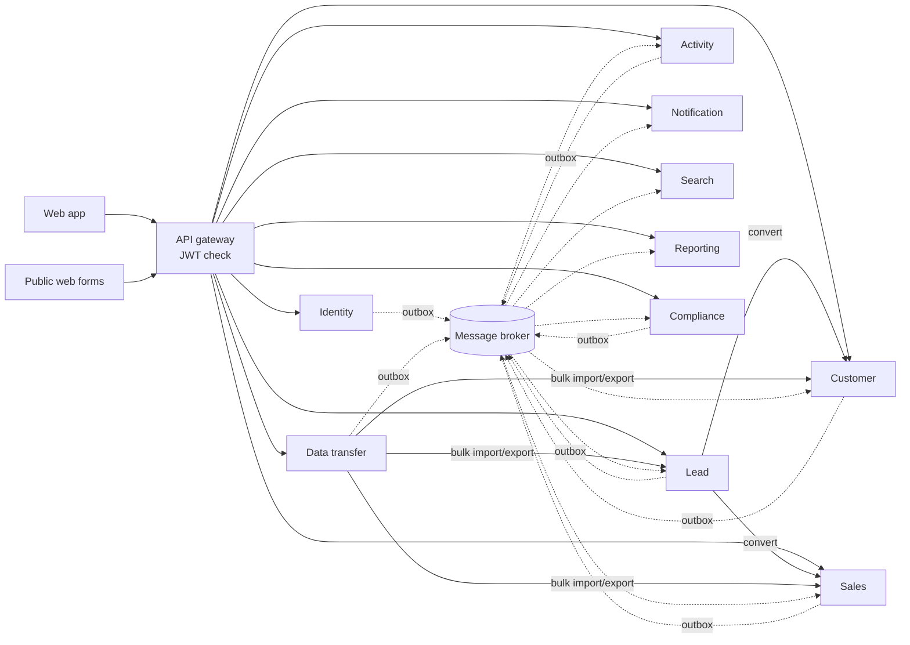
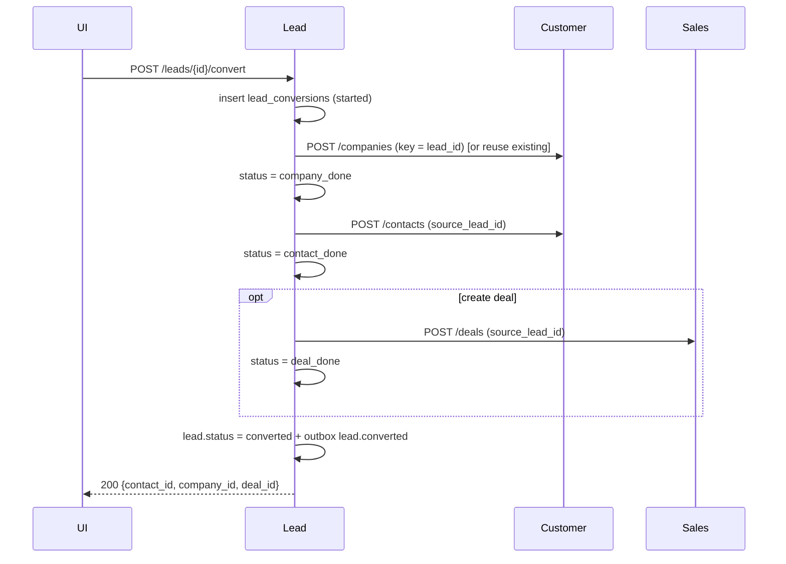

# CRM Platform: Architecture

> **Source of truth** for service boundaries, data ownership, events and cross-service workflows.
> Update this file in the same change whenever you add or change a service, an event, a
> synchronous API between services, or a saga. The rules in `CLAUDE.md` summarise this document.

- **Scope:** MVP ("must-have") features only.
- **Status:** Tech stack (language, broker, migration tool, frontend) not yet chosen; see [Open decisions](#10-open-decisions).

## Contents
1. [Principles](#1-principles)
2. [System overview](#2-system-overview)
3. [Service catalogue](#3-service-catalogue)
4. [Communication patterns](#4-communication-patterns)
5. [Event catalogue](#5-event-catalogue)
6. [Synchronous APIs between services](#6-synchronous-apis-between-services)
7. [Cross-service workflows](#7-cross-service-workflows)
8. [Security, permissions & compliance](#8-security-permissions--compliance)
9. [Deployment & operations](#9-deployment--operations)
10. [Open decisions](#10-open-decisions)
11. [Decision log](#11-decision-log)

---

## 1. Principles

| # | Principle | Consequence |
|---|---|---|
| P1 | **Database per service** | Each service owns one PostgreSQL database and one DB login. No other service may connect to it. |
| P2 | **No cross-service foreign keys** | Ids from other services are plain `UUID` columns; consistency is restored by events. |
| P3 | **Events first, sync calls by exception** | State changes are announced as events; only the calls in §6 are synchronous. |
| P4 | **Reliable publishing** | Transactional outbox in every database (`outbox_events`). |
| P5 | **Idempotent consumers** | `processed_events` inbox in every database; version checks on local copies. |
| P6 | **Local read-only copies over runtime joins** | A service keeps the few fields it needs from another service's data, fed by events. |
| P7 | **Multi-tenant from day one** | Every business row carries `organization_id`; every query filters by it. |
| P8 | **Eventual consistency is accepted** | Search, reports and name copies may lag live data by seconds. |

## 2. System overview



Solid arrows are synchronous HTTP/gRPC calls; dotted arrows are events. Each box has its own database.

## 3. Service catalogue

Schema files: `db/NN_<service>_db.sql`, which become each service's first migration in
`services/<service>/db/migrations/`. Every database also contains `outbox_events`,
`processed_events` and the `set_updated_at()` trigger function.

### 3.1 Identity (`identity_db`)
| | |
|---|---|
| **Responsibility** | Tenants, users, roles, teams, login, password reset, sessions; issues and signs JWTs |
| **Tables** | `organizations`, `teams`, `users`, `password_reset_tokens`, `user_sessions`; view `v_user_visibility` |
| **Publishes** | `organization.created`, `user.created`, `user.updated`, `user.deactivated`, `team.updated`, `user.logged_in`, `user.login_failed` |
| **Consumes** | none |
| **Sync API offered** | Login/refresh/logout, user & team admin, JWKS endpoint (public signing keys) |
| **Local copies** | none |
| **Personal data** | Staff users only (not customers); not part of customer erasure requests |

Roles: `admin` sees all records in the organization; `manager` sees their own records and their managed teams' records; `sales_rep` sees only their own records.
`v_user_visibility` computes `visible_owner_ids`, which goes into the JWT (§8).

### 3.2 Customer (`customer_db`)
| | |
|---|---|
| **Responsibility** | Companies and contacts: CRUD, custom fields, tags, duplicate detection, merge, reassignment |
| **Tables** | `companies`, `contacts`, `custom_field_definitions` (contact/company), `merge_history` |
| **Publishes** | `company.created/updated/deleted/restored/merged/reassigned`, `contact.created/updated/deleted/restored/merged/reassigned` |
| **Consumes** | `user.deactivated` (flags records for reassignment), `dsr.erasure_requested` |
| **Sync API offered** | CRUD + list/filter; `POST /companies`, `POST /contacts` with idempotency (used by lead conversion); bulk upsert (used by import) |
| **Local copies** | none |
| **Personal data** | Yes (contacts); main target of erasure requests |

Duplicate rules: unique live email per organization (`uq_contacts_email`) and unique live company domain per organization (`uq_companies_domain`). Fuzzy name matching uses the `pg_trgm` indexes.
`contacts.source_lead_id` is unique, so a retried lead conversion never creates a second contact.

### 3.3 Lead (`lead_db`)
| | |
|---|---|
| **Responsibility** | Lead capture (manual, web form, import), qualification, assignment, conversion saga |
| **Tables** | `lead_sources`, `web_forms`, `leads`, `custom_field_definitions` (lead), `lead_conversions` |
| **Publishes** | `lead.created`, `lead.assigned`, `lead.status_changed`, `lead.converted`, `lead.deleted`, `web_form.submitted` |
| **Consumes** | `contact.merged`, `company.merged` (re-point `converted_*_id`), `deal.deleted` (clear `converted_deal_id`), `dsr.erasure_requested` |
| **Sync API offered** | CRUD + list; public `POST /forms/{public_key}/submit` (no JWT; rate-limited, captcha); `POST /leads/{id}/convert`; bulk upsert |
| **Sync API used** | Customer (`POST /companies`, `POST /contacts`), Sales (`POST /deals`) during conversion |
| **Personal data** | Yes |

### 3.4 Sales (`sales_db`)
| | |
|---|---|
| **Responsibility** | Pipelines and stages, deals, deal-contact roles, stage history, won/lost with loss reasons |
| **Tables** | `pipelines`, `pipeline_stages`, `loss_reasons`, `deals`, `deal_contacts`, `deal_stage_history`, `custom_field_definitions` (deal), `customer_refs`; view `v_pipeline_board` |
| **Publishes** | `deal.created`, `deal.stage_changed`, `deal.won`, `deal.lost` (the database trigger writes these), plus `deal.updated`, `deal.reassigned`, `deal.deleted`, `pipeline.updated` |
| **Consumes** | `company.*`, `contact.*` (maintain `customer_refs`), `*.merged` (re-point ids), `activity.logged` (set `last_activity_at`), `dsr.erasure_requested` |
| **Sync API offered** | CRUD + board/list; `POST /deals` with idempotency via `source_lead_id`; bulk upsert |
| **Local copies** | `customer_refs`: company/contact display names so the board renders without calling Customer |
| **Personal data** | Indirect (contact ids, names in `customer_refs`) |

Triggers: `deals_track_stage` sets `status`, `closed_at` and `stage_entered_at` from the stage type and bumps `version`.
`deals_log_stage` writes `deal_stage_history` and the outbox event. The trigger reads the acting user from `SET app.current_user_id` (set once per transaction).

### 3.5 Activity (`activity_db`)
| | |
|---|---|
| **Responsibility** | Timeline (calls, emails, meetings, notes), participants, @mentions, tasks & reminders |
| **Tables** | `activities`, `activity_participants`, `mentions`, `tasks`, `record_refs`; view `v_open_tasks` |
| **Publishes** | `activity.logged` (the database trigger writes it), `activity.updated`, `activity.deleted`, `task.created`, `task.assigned`, `task.completed`, `task.reminder_due`, `task.overdue`, `mention.created` |
| **Consumes** | `lead.*`, `contact.*`, `company.*`, `deal.*` (maintain `record_refs`; soft-delete a timeline when its parent is deleted), `*.merged` (re-point links), `lead.converted` (link the lead's timeline to the new contact/deal), `dsr.erasure_requested` |
| **Background jobs** | Reminder scanner (`idx_tasks_reminders`) emits `task.reminder_due`; a daily job emits `task.overdue` |
| **Local copies** | `record_refs`: names and owners of leads/contacts/companies/deals |
| **Personal data** | Yes (notes, email bodies) |

### 3.6 Notification (`notification_db`)
| | |
|---|---|
| **Responsibility** | In-app notifications, email delivery, per-user notification preferences |
| **Tables** | `user_contacts`, `notifications`, `notification_preferences`, `email_deliveries` |
| **Publishes** | none |
| **Consumes** | `task.assigned`, `task.reminder_due`, `task.overdue`, `lead.assigned`, `deal.reassigned`, `contact.reassigned`, `mention.created`, `import.completed`, `export.completed`, `user.created/updated/deactivated` |
| **Idempotency** | `notifications.source_event_id` is unique, so each event produces at most one notification |
| **Personal data** | Staff emails; notification text may contain customer names, so it is covered by erasure |

### 3.7 Search (`search_db`)
| | |
|---|---|
| **Responsibility** | Global search across contacts, companies, leads, deals; saved views |
| **Tables** | `search_documents` (weighted `tsvector` + trigram), `saved_views` |
| **Publishes** | none |
| **Consumes** | `contact.*`, `company.*`, `lead.*`, `deal.*`, `dsr.erasure_requested` |
| **Sync API offered** | `GET /search?q=` returns ids, titles and types; the UI then loads full records from the owning service |
| **Notes** | Starts on PostgreSQL full-text search; can move to OpenSearch without changing other services. Saved views store filters that the UI sends to the owning service's list API. |

### 3.8 Reporting (`reporting_db`)
| | |
|---|---|
| **Responsibility** | Dashboards: pipeline by stage, forecast, won/lost, loss reasons, activity per user, lead-source conversion |
| **Tables** | `dim_users`, `dim_pipeline_stages`, `fact_deals`, `fact_deal_stage_changes`, `fact_leads`, `fact_activities` |
| **Views** | `v_pipeline_by_stage`, `v_sales_forecast`, `v_won_lost`, `v_loss_reasons`, `v_activity_by_user`, `v_lead_source_performance` |
| **Publishes** | none |
| **Consumes** | `user.*`, `team.updated`, `pipeline.updated`, `deal.*`, `lead.*`, `activity.logged`, `activity.deleted` |
| **Rebuild** | Read models can be rebuilt by replaying events or by a one-off backfill through each owner's list API |
| **Personal data** | Minimal (ids, amounts); staff names only |

### 3.9 Data transfer (`data_transfer_db`)
| | |
|---|---|
| **Responsibility** | CSV import (upload, field mapping, duplicate strategy, row errors, undo) and CSV export |
| **Tables** | `import_jobs`, `import_job_errors`, `import_job_records`, `export_jobs` |
| **Publishes** | `import.completed`, `import.failed`, `export.completed` |
| **Sync API used** | Customer / Lead / Sales bulk upsert and list endpoints; never their databases |
| **Storage** | Uploaded and generated files live in object storage (S3/GCS/MinIO); export links expire |
| **Resumability** | `processed_rows` is the resume point; `import_job_records` is keyed by row, so a resumed batch doesn't duplicate records |

### 3.10 Audit & compliance (`compliance_db`)
| | |
|---|---|
| **Responsibility** | Central, append-only audit trail; consent history; data subject requests (GDPR, India DPDP Act) |
| **Tables** | `audit_log` (append-only trigger), `consents`, `data_subject_requests`, `dsr_service_tasks`; view `v_current_consent` |
| **Publishes** | `dsr.erasure_requested`, `dsr.access_requested`, `consent.changed` |
| **Consumes** | Every domain event (writes `audit_log`), `web_form.submitted` (records consent), `lead.converted` (copies consents to the contact), `dsr.*_completed` |
| **Idempotency** | `audit_log.source_event_id` is unique |

## 4. Communication patterns

### 4.1 Transactional outbox
```
BEGIN;
  UPDATE deals SET stage_id = ... WHERE id = ...;          -- business change
  INSERT INTO outbox_events (...) VALUES (...);            -- event, same transaction
COMMIT;
-- relay (separate process): SELECT ... WHERE published_at IS NULL ORDER BY occurred_at
--   -> publish to broker -> UPDATE outbox_events SET published_at = now()
```
- The relay publishes **at least once**, so consumers must deduplicate.
- Partition key / routing key = `aggregate_id`, which preserves the order of events for one record.
- Purge published outbox rows after 7 days.

### 4.2 Consumer handling
```
BEGIN;
  INSERT INTO processed_events (event_id, event_type) VALUES (...)
      ON CONFLICT DO NOTHING;                              -- 0 rows -> already handled -> COMMIT & ack
  -- for local copies: apply only if event.version > source_version
  ... apply change ...
COMMIT;  -- then ack the message
```
- If a handler fails, retry it with backoff. After N attempts, move the message to a dead-letter queue and raise an alert.
- Handlers never call other services synchronously.

### 4.3 Event envelope
```json
{
  "event_id": "uuid",
  "event_type": "deal.stage_changed",
  "organization_id": "uuid",
  "aggregate_type": "deal",
  "aggregate_id": "uuid",
  "version": 7,
  "occurred_at": "2026-09-28T09:15:00Z",
  "actor_id": "uuid | null",
  "payload": { }
}
```
Naming: `<aggregate>.<past_tense_verb>`. Adding a payload field is allowed. Removing or renaming a
field requires a new event type version (`deal.stage_changed.v2`), with both versions published
during the transition.

## 5. Event catalogue

| Event | Publisher | Key payload fields | Consumers |
|---|---|---|---|
| `organization.created` | Identity | name, default_currency, timezone | Compliance |
| `user.created` / `user.updated` | Identity | user_id, email, name, role, team_id, is_active | Notification, Reporting, Compliance |
| `user.deactivated` | Identity | user_id | Customer, Lead, Sales, Activity (reassignment queue), Notification |
| `team.updated` | Identity | team_id, name, manager_id, member_ids | Reporting |
| `user.logged_in` / `user.login_failed` | Identity | user_id / email, ip, user_agent | Compliance |
| `company.created` / `.updated` | Customer | full company snapshot + version | Sales, Activity, Search, Compliance |
| `company.deleted` / `.restored` | Customer | company_id, version | Sales, Activity, Search, Compliance |
| `company.merged` | Customer | survivor_id, loser_id | Sales, Activity, Lead, Search, Compliance |
| `contact.created` / `.updated` | Customer | full contact snapshot + version | Sales, Activity, Search, Compliance |
| `contact.deleted` / `.restored` | Customer | contact_id, version | Sales, Activity, Search, Compliance |
| `contact.merged` | Customer | survivor_id, loser_id | Sales, Activity, Lead, Search, Compliance |
| `contact.reassigned` / `company.reassigned` | Customer | id, from_owner_id, to_owner_id | Notification, Search, Compliance |
| `lead.created` / `lead.status_changed` | Lead | lead snapshot + version, source | Activity, Search, Reporting, Compliance |
| `lead.assigned` | Lead | lead_id, owner_id | Notification, Search, Compliance |
| `lead.converted` | Lead | lead_id, contact_id, company_id, deal_id | Activity, Reporting, Search, Compliance |
| `lead.deleted` | Lead | lead_id, version | Activity, Search, Reporting, Compliance |
| `web_form.submitted` | Lead | form_id, lead_id, consent_text, ip | Compliance |
| `deal.created` / `.updated` | Sales | deal snapshot + version | Activity, Search, Reporting, Compliance |
| `deal.stage_changed` / `.won` / `.lost` | Sales | deal_id, from/to stage, status, amount, owner_id, changed_by | Reporting, Search, Activity, Compliance |
| `deal.reassigned` | Sales | deal_id, from/to owner | Notification, Search, Reporting, Compliance |
| `deal.deleted` | Sales | deal_id, version | Activity, Search, Reporting, Lead, Compliance |
| `pipeline.updated` | Sales | pipeline + stages (name, order, probability, type) | Reporting |
| `activity.logged` | Activity | activity_id, type, occurred_at, owner_id, linked ids | Sales, Reporting, Compliance |
| `activity.updated` / `.deleted` | Activity | activity_id | Reporting, Compliance |
| `task.created` / `.completed` | Activity | task_id, assigned_to, due_at, linked ids | Compliance |
| `task.assigned` / `.reminder_due` / `.overdue` | Activity | task_id, assigned_to, title, due_at | Notification |
| `mention.created` | Activity | activity_id, mentioned_user_id, author_id | Notification |
| `import.completed` / `.failed` | Data transfer | job_id, counts, user_id | Notification, Compliance |
| `export.completed` | Data transfer | job_id, entity_type, row_count, user_id | Notification, Compliance |
| `consent.changed` | Compliance | subject, purpose, channel, status | Customer, Lead (optional "do not contact" flag) |
| `dsr.erasure_requested` / `.access_requested` | Compliance | dsr_id, subject_refs, requester_email | Customer, Lead, Sales, Activity, Notification, Search, Reporting, Data transfer |
| `dsr.erasure_completed` / `.access_completed` | each service above | dsr_id, service, records_affected | Compliance |

## 6. Synchronous APIs between services

The **only** permitted service-to-service calls. Adding one requires updating this table and approval.

| Caller | Callee | Endpoint | Purpose | Failure behaviour |
|---|---|---|---|---|
| All services | Identity | `GET /.well-known/jwks.json` | Verify JWT signatures (cache keys ~1 h) | Use cached keys |
| Lead | Customer | `POST /companies`, `POST /contacts` (Idempotency-Key = lead_id) | Lead conversion | Saga retries; conversion stays "in progress" |
| Lead | Sales | `POST /deals` (source_lead_id) | Lead conversion | Saga retries |
| Data transfer | Customer / Lead / Sales | `POST /bulk-upsert`, `GET /export` (paged) | Import / export | Job pauses and resumes from `processed_rows` |
| Sales, Activity | Customer / Lead / Sales | `GET /{type}/{id}` | Fallback when a record is missing from the local copy | Show id placeholder; retry later |

Calls between services use a service token (client credentials), never a user's JWT. They pass
through `organization_id` and `actor_id` as headers and have a 2–5 s timeout.

## 7. Cross-service workflows

### 7.1 Lead conversion (orchestrated saga)

- **Retry:** a background worker resumes conversions in `idx_conversions_pending` from the last completed step. Idempotency keys make every step safe to repeat.
- **Compensation:** if a step fails permanently, the conversion is marked `failed` and the lead stays unconverted. Records already created are left in place and linked, and the user can finish the conversion manually. Automatic deletion is not used, because it risks deleting data someone has started using.
- **Follow-ups (via `lead.converted`):** Activity links the lead's timeline to the new contact/deal, Compliance copies the lead's consents to the contact, and Reporting marks the lead converted.

### 7.2 Merging duplicates
1. The user picks a surviving record and field values. Customer copies the values, sets `merged_into_id` and `deleted_at` on the losing record, and writes `merge_history`.
2. The outbox publishes `contact.merged {survivor_id, loser_id}`.
3. Sales (`deals.primary_contact_id`, `deal_contacts`), Activity (links, participants), Lead (`converted_contact_id`) and Search each re-point from the losing record to the survivor.

### 7.3 Deleting a record (soft delete)
- The owner sets `deleted_at` and publishes `*.deleted`. Sales and Activity mark their local copies deleted and hide related items. Search removes the document.
- Restore publishes `*.restored`, and consumers reverse the delete.
- A nightly purge hard-deletes rows deleted more than 30 days ago. Consumers do the same for their local copies.

### 7.4 Reassigning records when a user leaves
Identity publishes `user.deactivated`. Each owning service lists that user's open records in a
reassignment queue. An admin picks a new owner, and each service updates `owner_id` and publishes
`*.reassigned`.

### 7.5 Data subject requests (erasure / access)
```
Compliance: create data_subject_requests + one dsr_service_tasks row per service
         -> publish dsr.erasure_requested {dsr_id, subject_refs, requester_email}
Each service: find the person's data (by ids and email) -> hard-delete / anonymise
         (including local copies, search documents, notifications)
         -> publish dsr.erasure_completed {dsr_id, service, records_affected}
Compliance: mark the task complete; close the request when all tasks are complete.
```
- The audit log keeps the *fact* that an erasure happened (action `erase`), without the personal data.
- An access request follows the same flow. Each service uploads its export and Compliance compiles one file (`result_file_url`).

### 7.6 Deal board data flow (why no joins are needed)
Customer publishes `company.updated`. Sales updates `customer_refs.display_name` (only if the version is newer). `v_pipeline_board` then joins `deals` to its local `customer_refs`, so a single-database query renders the board.

## 8. Security, permissions & compliance

- **Authentication:** Identity issues short-lived access JWTs (15 min) and rotating refresh tokens (`user_sessions`, stored as hashes). Passwords are hashed with argon2id or bcrypt. After repeated failed logins the account is locked (`failed_login_count`, `locked_until`).
- **JWT claims:** `sub` (user_id), `organization_id`, `role`, `team_id`, `visible_owner_ids` (omitted for admins, meaning everything in the organization).
- **Authorization in every service:** `organization_id = claim` always; plus `owner_id = ANY(visible_owner_ids)` for non-admins. `organization_id` is never taken from the request body.
- **Stale permissions:** visibility changes (team moves) take effect when the token refreshes, within 15 minutes.
- **Optional hardening:** PostgreSQL Row-Level Security using `SET app.organization_id` / `app.visible_owner_ids` per transaction.
- **Database isolation:** one login role per database, `REVOKE ALL ... FROM PUBLIC`. Tested: `sales_svc` is denied access to `customer_db.contacts`.
- **Transport & storage:** TLS on every connection (gateway, service-to-service, DB, broker); encryption at rest on volumes, backups and object storage.
- **Logging:** log ids, never emails, phones or names.
- **Compliance targets:** GDPR and India's DPDP Act. This covers consent history, erasure and access requests with deadlines (`due_at`), and a tamper-proof audit trail.

## 9. Deployment & operations

### 9.1 Phased rollout
Every database is already separate, so services can start grouped into fewer deployables and split later without moving data.

| Phase | Deployables | Contains |
|---|---|---|
| 1 (MVP launch) | 5 | Identity · Customer+Lead · Sales+Activity · Notification · Platform (Search+Reporting+Data transfer+Compliance) |
| 2 (growth) | 10 | Split each group into its own service when team size or load justifies it |

Grouped services still use separate database logins and must follow every rule here. A grouped
deployable connects to each of its databases with that database's own login.

### 9.2 Infrastructure
- **PostgreSQL:** one server hosting all 10 databases is fine for development and early production. Move Activity and Reporting to their own servers first as load grows.
- **Backups:** daily backups plus point-in-time recovery **per database**, with a restore drill every quarter.
- **Broker:** one topic/exchange per publishing service (e.g. `crm.sales.events`), keyed by `aggregate_id`, with a dead-letter queue per consumer.
- **Observability:** propagate a correlation id from the gateway through calls and events. Track per-consumer lag and outbox backlog (`idx_outbox_unpublished`) with alerts.
- **Setup:** `db/00_create_databases.sql` creates the databases and login roles. Replace the `change_me` passwords with secrets from a vault.

### 9.3 Testing expectations
- Apply each service's migrations to a fresh database as that service's own role (not a superuser).
- Test the database-enforced business rules (listed in `CLAUDE.md`).
- For each consumer, test that the same event delivered twice produces the same result, and that an older event arriving after a newer one is ignored.
- For each saga, run contract tests against the called service's API.

## 10. Open decisions

| Decision | Options | Notes |
|---|---|---|
| Backend language / framework | TBD | Ideally one stack for all services at first |
| Message broker | Kafka / RabbitMQ / NATS | RabbitMQ or NATS is simpler at MVP scale; Kafka if replay and high volume matter |
| Migration tool | Flyway / Liquibase / Prisma / Alembic | One per service, same tool everywhere |
| Frontend | TBD | |
| Hosting | TBD | Managed PostgreSQL recommended |
| API gateway | TBD | Must validate JWTs and rate-limit public form submissions |

## 11. Decision log

| # | Date | Decision | Reason |
|---|---|---|---|
| D1 | 2026-09-28 | MVP limited to "must-have" features | Establish daily CRM use before adding automation, integrations and AI |
| D2 | 2026-09-28 | Microservices with a separate database per service | Independent scaling, deployment and ownership |
| D3 | 2026-09-28 | PostgreSQL for every service | JSONB custom fields, full-text search, strong constraints |
| D4 | 2026-09-28 | `organization_id` on every table | Makes a SaaS / multi-tenant option possible without migrating data later |
| D5 | 2026-09-28 | Transactional outbox + idempotent consumers | No lost or duplicated side effects without distributed transactions |
| D6 | 2026-09-28 | Local read-only copies (`customer_refs`, `record_refs`) | Screens render from one database; no runtime dependency between services |
| D7 | 2026-09-28 | Search and reporting as event-fed read models | Keep heavy queries off the services that handle writes |
| D8 | 2026-09-28 | Lead conversion as an orchestrated saga without automatic compensation | Safe retries; avoids deleting data a user may already be using |
| D9 | 2026-09-28 | Tags stored as `TEXT[]` on each record | Avoids a shared tag table across services |
